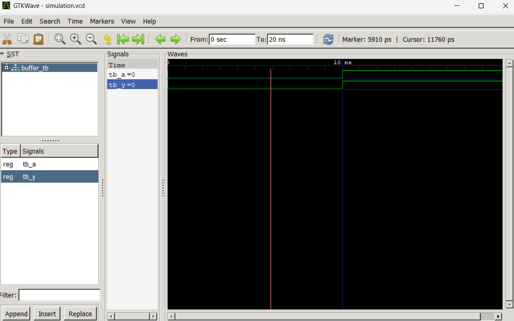

Lab 1: Introduction to VHDL Programming and Open-Source Simulation Environment

Objective

• To set up and configure the VHDL development environment (VS Code, GHDL, and
GTKWave).
• To understand the fundamental structure and components of a VHDL design.
• To write, simulate, and visualize a basic VHDL program.

Theory

VHDL is an acronym for VHSIC Hardware Description Language (VHSIC stands for Very High
Speed Integrated Circuits). It is an IEEE industry-standard hardware description language
that can be used to model a digital system at many levels of abstraction, ranging from the
algorithmic level to the gate level. Unlike conventional programming languages, VHDL allows
designers to model how signals flow through logic gates and flip-flops concurrently (at the
same time).

VHDL Structure

A VHDL design is typically composed of three essential parts:

1. Library and Packages: These contain predefined data types, constants, and functions.
The most common library used is IEEE, which provides the standard std logic types.

2. Entity: Defines the external interface of the circuit. It specifies the input and output
ports (pins) through which the circuit communicates with the outside world.

3. Architecture: Defines the internal logic or behavior of the entity. It describes how the
outputs are generated based on the inputs.

Libraries and Packages

A Library is a compiled directory where VHDL design units (such as entities, architectures,
and packages) are stored. The two most important libraries are:

• Library std: This is automatically included in every VHDL design. It contains the most
basic built-in data types such as bit, integer, boolean, and character, along with their
corresponding operators (logic, arithmetic, comparison, shift, and concatenation).

• Library IEEE: The most widely used library in VHDL. It provides the std logic and
std logic vector types that are essential for real hardware design. You must explicitly
declare this library and the relevant package at the top of your file:

library IEEE ;
use IEEE . STD_LOGIC_1164 .ALL ; -- Provides std_logic types
use IEEE . NUMERIC_STD .ALL ; -- Provides arithmetic on
std_logic

Entity

The entity describes the external view of a circuit, what goes in and what comes out. Think of
it as the “black box” definition of your component. It declares the ports: the names, directions
(in, out, inout), and data types of every signal that crosses the boundary.
The general syntax of an entity is:
entity < entity_name > is
port (
< port_name > : < direction > < data_type >;
< port_name > : < direction > < data_type >
-- No semicolon on the last port
) ;
end entity < entity_name >;
Port Directions:
• in: signal flows into the entity (input).
• out: signal flows out of the entity (output).
• inout: signal can flow both ways (bidirectional, e.g., a bus).

Example: An entity for a 2-input AND gate:

entity AND_GATE is
port (
A : in std_logic ;
B : in std_logic ;
Y : out std_logic
) ;
end entity AND_GATE ;

Architecture

The architecture defines the internal behavior or structure of the entity. If the entity is the black box, the architecture is what is inside it. One entity can have multiple architectures (e.g one behavioral and one structural), but only one is active at a time.

The general syntax of an architecture is:

architecture < arch_name > of < entity_name > is
-- Declarations : internal signals , constants , components
begin
-- Concurrent statements describing the logic
end architecture < arch_name >;

Example: Architecture for the AND gate:

architecture Behavioral of AND_GATE is
begin
Y <= A and B ; -- Concurrent signal assignment
end architecture Behavioral ;

A key concept here is that the statement Y <= A and B; is a concurrent signal assignment.
It does not execute line by line like a program, instead it continuously monitors A and B and updates Y whenever either changes, just like a real logic gate.

Types of Architectural Models

VHDL supports three styles of writing an architecture, each describing the same circuit at a
different level of abstraction:

1. Behavioral Model: Describes what the circuit does using sequential statements inside
a process block. It is the most abstract style and closest to conventional programming.
architecture Behavioral of AND_GATE is
begin
process (A , B )
begin
Y <= A and B ;
end process ;
end architecture Behavioral ;

2. Dataflow Model: Describes how data flows through the circuit using concurrent signal
assignments (no process block). It is between behavioral and structural in abstraction
level.

architecture Dataflow of AND_GATE is
begin
Y <= A and B ; -- Executes concurrently , not sequentially
end architecture Dataflow ;
3. Structural Model: Describes the circuit as an interconnection of sub-components,
similar to a netlist or schematic. It is the most detailed and closest to the actual hardware.
architecture Structural of AND_GATE is
component AND2 -- Declare a lower - level component
port (X , Z : in std_logic ; W : out std_logic ) ;
end component ;
begin
U1 : AND2 port map ( X = > A , Z = > B , W = > Y ) ;
end architecture Structural ;

In this lab, we will primarily use the Dataflow style for its simplicity. Behavioral and Structural modeling will be explored in later labs.

Basic Data Types and Signals

1. std logic: The standard type for a single-bit signal. Unlike the simpler bit type (which
can only be ’0’ or ’1’), std logic supports nine values including ’Z’ (High Impedance)
and ’U’ (Uninitialized), making it much more realistic for hardware modeling. 

2. std logic vector: Used to represent a group of bits (a bus). For example, std logic vector(7 downto 0) represents an 8-bit bus. The range 7 downto 0 means bit 7 is the most significant bit (MSB).

3. Signals: Internal wires inside an architecture. They are declared between the architecture... is line and the begin keyword.

architecture Behavioral of MY_CIRCUIT is
signal internal_wire : std_logic ; -- 1 -bit wire
signal data_bus : std_logic_vector (7 downto 0) ; -- 8 -
bit bus
begin
-- ...
end architecture Behavioral ;

VHDL Design Cycle

To verify a design before it is physically implemented, it must pass through the simulation
design cycle:

1. Analysis (Compilation): The compiler checks the source code for syntax errors and
ensures it follows language rules.

2. Elaboration: The hierarchical design is “flattened” into a netlist. The simulator binds
entities to architectures and connects all signals.

3. Simulation: Stimuli (inputs) are applied to the design to verify its functional behavior
over time.

4. Visual Verification: Tools like GTKWave read the generated VCD (Value Change
Dump) file to display the timing diagrams of the signals.

Discussion:
The primary objective of this experiment was to design and simulate a digital system using VHDL within an open-source environment. The transition from a conceptual logic diagram to a hardware description highlighted the unique concurrent nature of VHDL. Unlike sequential software programming, the simulation demonstrated that signals propagate through gates simultaneously, as evidenced by the timing diagrams generated in GTKWave.

OUTPUT:

Conclusion
This lab successfully demonstrated the workflow of digital design using VHDL and the open-source toolchain consisting of GHDL and GTKWave.