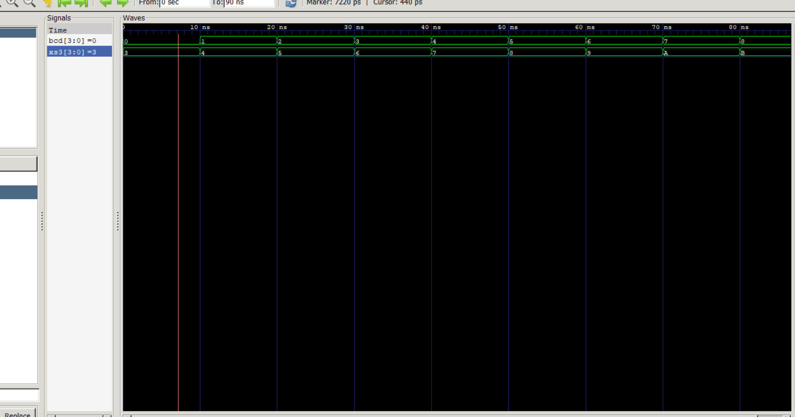
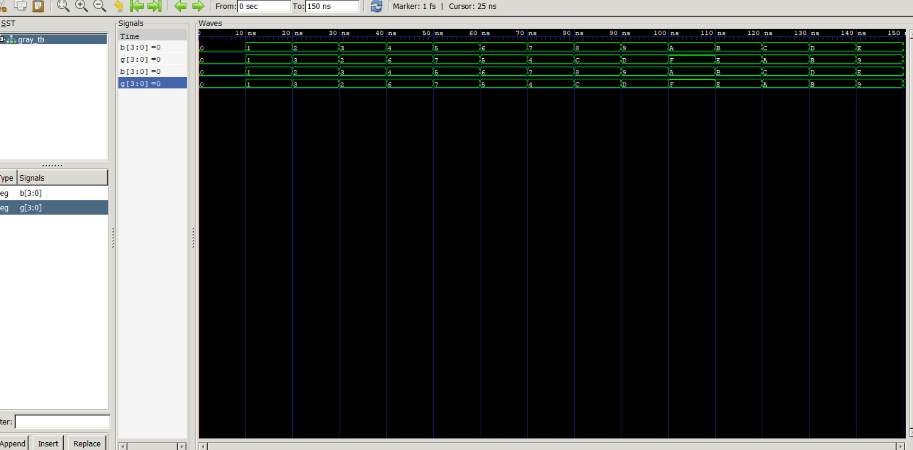

Lab 6: VHDL Code for Combinational Circuits – Code Converter

Objective

To design and simulate a BCD-to-Excess-3 Code Converter using VHDL.
To design and simulate a Binary-to-Gray Code Converter using VHDL.
To verify the functionality of both combinational circuits using GHDL and GTKWave.

Theory

BCD to Excess-3 Code Converter

Excess-3 (XS-3) is a non-weighted Binary Coded Decimal (BCD) code obtained by adding 3 (0011) to the corresponding BCD digit. Since every decimal digit is represented by its BCD equivalent plus three, the code is called Excess-3. It is a self-complementing code and is commonly used in decimal arithmetic circuits because it simplifies complement operations.

The conversion is performed as:

Excess-3=BCD+3
Decimal	BCD	Excess-3
0	0000	0011
1	0001	0100
2	0010	0101
3	0011	0110
4	0100	0111
5	0101	1000
6	0110	1001
7	0111	1010
8	1000	1011
9	1001	1100
Binary to Gray Code Converter

Gray code is a binary numbering system in which consecutive numbers differ by only one bit. This property minimizes errors during bit transitions and makes Gray code suitable for rotary encoders, analog-to-digital converters, and communication systems.

The conversion from Binary to Gray follows these rules:

MSB of Gray = MSB of Binary
Remaining Gray bits are obtained by XORing adjacent binary bits.

Mathematically,

G₃ = B₃
G₂ = B₃ ⊕ B₂
G₁ = B₂ ⊕ B₁
G₀ = B₁ ⊕ B₀

where ⊕ represents the Exclusive-OR (XOR) operation.

Discussion

The objective of this experiment was to design and simulate two combinational code converters using VHDL in an open-source simulation environment. The BCD-to-Excess-3 converter was implemented by adding the binary value 0011 to the input BCD number using the numeric_std package. The simulation confirmed that each valid BCD input produced the corresponding Excess-3 output.

The Binary-to-Gray converter was implemented using concurrent XOR operations according to the Gray code conversion rules. The waveform generated by GTKWave verified that the Gray code output changed correctly for each binary input, ensuring that adjacent Gray code values differed by only one bit.

The simulations performed with GHDL and visualized using GTKWave confirmed the correctness of both VHDL designs. The waveforms matched the theoretical truth tables, demonstrating that the combinational circuits functioned as expected.

Output
1. BCD-to-Excess-3 Converter Waveform

Observation:

BCD 0000 → XS-3 0011
BCD 0001 → XS-3 0100
BCD 0010 → XS-3 0101
BCD 0011 → XS-3 0110
BCD 0100 → XS-3 0111
BCD 0101 → XS-3 1000
BCD 0110 → XS-3 1001
BCD 0111 → XS-3 1010
BCD 1000 → XS-3 1011
BCD 1001 → XS-3 1100

The waveform verifies that the converter correctly adds 3 to each BCD input.

2. Binary-to-Gray Converter Waveform

Observation:

The waveform verifies the following Binary-to-Gray conversions:

Binary	Gray
0000	0000
0001	0001
0010	0011
0011	0010
0100	0110
0101	0111
0110	0101
0111	0100
1000	1100
1001	1101
1010	1111
1011	1110
1100	1010
1101	1011
1110	1001
1111	1000

The waveform confirms that the Gray code output follows the XOR conversion rule and that consecutive Gray codes differ by only one bit.

Conclusion

This lab successfully demonstrated the design and simulation of two combinational code converters using VHDL and the open-source tools GHDL and GTKWave. The BCD-to-Excess-3 converter correctly generated Excess-3 code by adding three to each valid BCD input, while the Binary-to-Gray converter correctly implemented Gray code conversion using XOR operations. The simulation waveforms matched the expected theoretical outputs, confirming the correctness of the VHDL implementations and providing a clear understanding of combinational circuit design and verification.