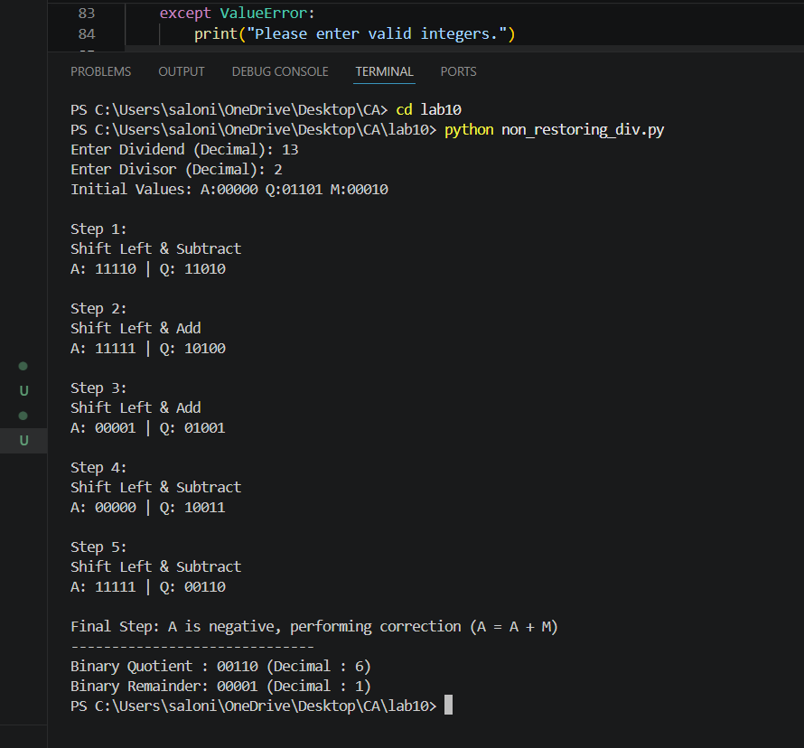

Lab Report
Lab 10: Implementation of Non-Restoring Division Algorithm Using Python
Title

Implementation of Non-Restoring Division Algorithm Using Python

Objective
To understand the working of the Non-Restoring Division Algorithm.
To implement the Non-Restoring Division Algorithm using Python.
To perform binary division using shift, addition, and subtraction operations.
To obtain the quotient and remainder in both binary and decimal forms.
Theory

The Non-Restoring Division Algorithm is a binary division algorithm used in computer architecture for efficient hardware implementation of division. Unlike the restoring division algorithm, it does not restore the accumulator after every unsuccessful subtraction. Instead, the next operation depends on the sign of the accumulator.

Initially, the accumulator (A) is set to zero, the dividend is loaded into the quotient register (Q), and the divisor is stored in register (M). At each iteration:

The combined register AQ is shifted left.
If the previous accumulator is positive, subtract the divisor from the accumulator.
If the previous accumulator is negative, add the divisor to the accumulator.
If the accumulator is positive after the operation, append 1 to the quotient.
If the accumulator is negative, append 0 to the quotient.
After all iterations, if the accumulator is negative, a final correction is performed by adding the divisor.

The algorithm produces the quotient and remainder without restoring the accumulator after every unsuccessful subtraction, making it more efficient than restoring division.

Algorithm
Read the dividend and divisor.
Determine the required bit length.
Initialize:
Accumulator (A) = 0
Quotient (Q) = Dividend
Divisor (M) = Divisor
Compute the two's complement of the divisor.
Repeat for each bit:
Shift AQ left by one bit.
If the previous accumulator is positive, subtract the divisor.
Otherwise, add the divisor.
Set the least significant bit of the quotient according to the sign of the accumulator.
If the accumulator is negative after the final iteration, add the divisor to restore the correct remainder.
Display the binary and decimal quotient and remainder.
Program

Python Code

(Paste your complete Python program here.)

Input
Dividend = 13
Divisor = 2
Output
Terminal Output

Paste Screenshot Here

(Insert the provided terminal screenshot.)

Observation
Step	Operation	Accumulator (A)	Quotient (Q)
Initial	Initialization	00000	01101
Step 1	Shift Left & Subtract	11110	11010
Step 2	Shift Left & Add	11111	10100
Step 3	Shift Left & Add	00001	01001
Step 4	Shift Left & Subtract	00000	10011
Step 5	Shift Left & Subtract	11111	00110
Final	Correction (A = A + M)	00001	00110
Result

For the given inputs:

Dividend = 13
Divisor = 2

The program produced:

Binary Quotient

00110

Decimal Quotient

6

Binary Remainder

00001

Decimal Remainder

1

The result satisfies:

13÷2=6 remainder 1
Conclusion

The Non-Restoring Division Algorithm was successfully implemented in Python. The program correctly performed binary division using shift, addition, subtraction, and final correction operations. The quotient and remainder obtained matched the expected mathematical result. This experiment demonstrates the efficiency of the Non-Restoring Division Algorithm in digital systems and computer architecture.

Screenshot

