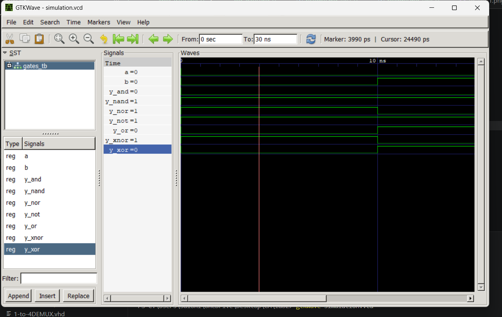

 # Lab 2: VHDL Code for Realizing Logic Gates

## Objective

* To write VHDL code for basic logic gates: AND, OR, NOT, NAND, NOR, XOR, and
XNOR.
* To simulate each gate and verify its truth table using GTKWave.

## Theory

Logic gates are the fundamental building blocks of all digital circuits. Each gate performs a
basic Boolean operation on one or more binary inputs to produce a single binary output.

## Gate Operators and Boolean Expressions

| Gate | VHDL Operator | Boolean Expression |
| :--- | :--- | :--- |
| AND  | `and`  | Y = A · B |
| OR   | `or`   | Y = A + B |
| NOT  | `not`  | Y = A̅ |
| NAND | `nand` | Y = (A · B)̅ |
| NOR  | `nor`  | Y = (A + B)̅ |
| XOR  | `xor`  | Y = A ⊕ B |

## OUTPUT

## Conclusion 
In this lab, we successfully designed and simulated the behavioral models for various fundamental digital logic gates (AND, OR, NOT, NAND, NOR, and XOR) using VHDL. Through this process, we verified that the synthesized VHDL code accurately matches the theoretical truth tables and Boolean expressions for each gate. This experiment successfully demonstrated the efficiency of Hardware Description Languages (HDLs) in modeling basic combinational logic elements.