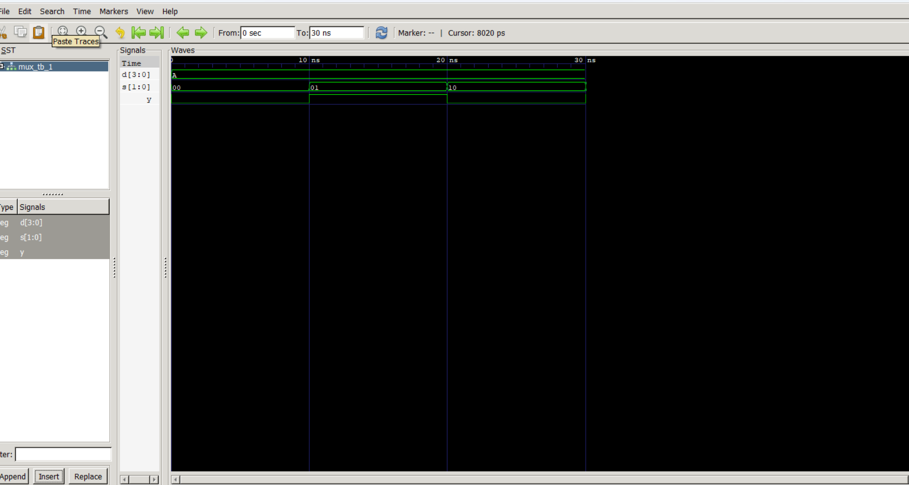
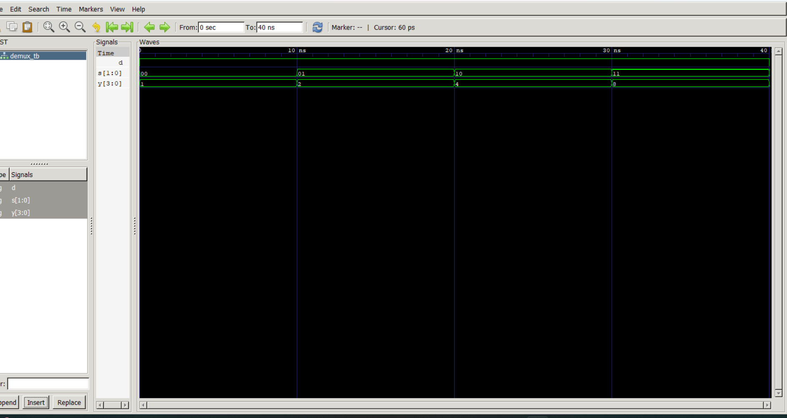

# Lab 4: VHDL Code for Combinational Circuits (MUX and DEMUX)

## Objective
- To design and simulate a 4-to-1 Multiplexer (MUX) in VHDL.
- To design and simulate a 1-to-4 Demultiplexer (DEMUX) in VHDL.

---

## Theory

### Multiplexer (MUX)

A multiplexer selects one of **2ⁿ input data lines** and routes it to a single output based on **n select lines**.

A **4-to-1 MUX** has:
- 4 data inputs (D0–D3)
- 2 select lines (S1, S0)
- 1 output (Y)

The selection table is given below:

| S1 | S0 | Y  |
|----|----|----|
| 0  | 0  | D0 |
| 0  | 1  | D1 |
| 1  | 0  | D2 |
| 1  | 1  | D3 |

### Demultiplexer (DEMUX)

A demultiplexer routes a single input to one of **2ⁿ output lines** based on **n select lines**.

A **1-to-4 DEMUX** has:
- 1 data input (D)
- 2 select lines (S1, S0)
- 4 outputs (Y0–Y3)

The active output selection is shown below:

| S1 | S0 | Active Output |
|----|----|---------------|
| 0  | 0  | Y0 = D        |
| 0  | 1  | Y1 = D        |
| 1  | 0  | Y2 = D        |
| 1  | 1  | Y3 = D        |

## Output:
1) Mux:

2) DeMux:

## Conclusion:
In this lab, we successfully designed and simulated combinational circuits using VHDL: a 4-to-1 Multiplexer (MUX) and a 1-to-4 Demultiplexer (DEMUX). The MUX correctly selected one of the four input lines based on the 2-bit select signals and routed it to a single output. Similarly, the DEMUX took a single input and directed it to one of four output lines depending on the select inputs, while keeping the other outputs inactive.

From this experiment, it is clear that multiplexers and demultiplexers are fundamental building blocks in digital systems. A MUX is widely used for data selection and routing, while a DEMUX is used for data distribution. This lab helped in understanding how combinational logic circuits can be implemented and verified using VHDL, reinforcing the concepts of data selection, control signals, and hardware modeling in computer architecture.