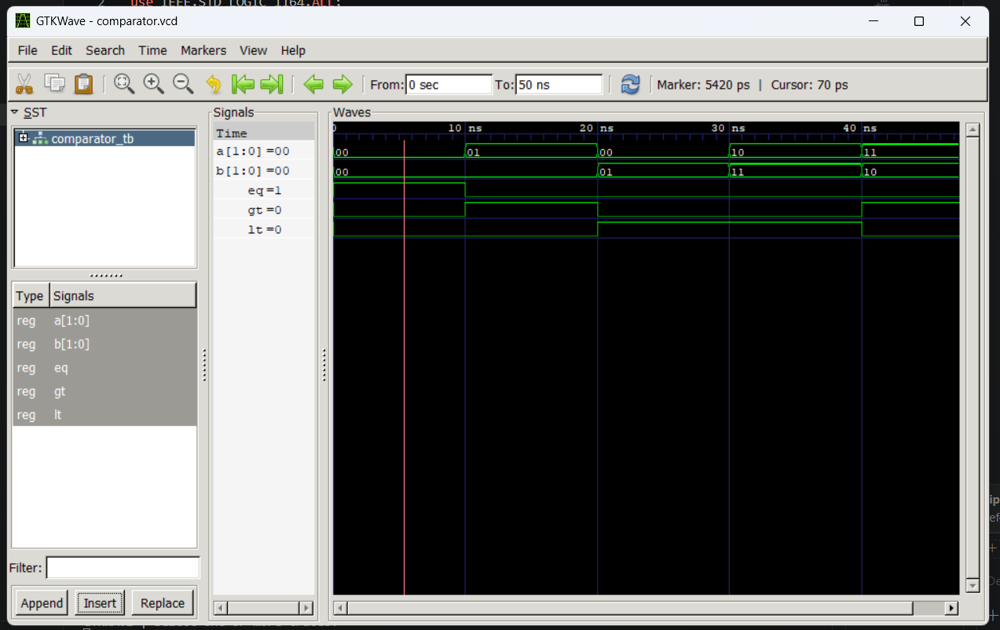

# Lab 5: VHDL Code for Combinational Circuits – 2-bit Comparator
## Objective
* To design and simulate a 2-bit magnitude comparator in VHDL.
* To understand how comparison operations are implemented in digital hardware.
## Theory

A magnitude comparator compares two binary numbers and generates three output signals:

EQ (Equal): HIGH when A = B
GT (Greater Than): HIGH when A > B
LT (Less Than): HIGH when A < B

For a 2-bit comparator with inputs A = A1A0 and B = B1B0, the Boolean expressions are:
EQ = (A1 ⊙ B1) · (A0 ⊙ B0)

GT = (A1 · B1') + ((A1 ⊙ B1) · A0 · B0')

LT = (A1' · B1) + ((A1 ⊙ B1) · A0' · B0)

where:

⊙ denotes the XNOR operation.
' denotes the complement (NOT) operation.
· denotes the AND operation.
+ denotes the OR operation.

### Expected Output

| A  | B  | EQ | GT | LT |
|----|----|----|----|----|
| 00 | 00 | 1  | 0  | 0  |
| 01 | 00 | 0  | 1  | 0  |
| 00 | 01 | 0  | 0  | 1  |
| 10 | 11 | 0  | 0  | 1  |
| 11 | 10 | 0  | 1  | 0  |
| 11 | 11 | 1  | 0  | 0  |

## Output:

## Conclusion

The 2-bit magnitude comparator was successfully designed and simulated using VHDL. The circuit correctly determined whether one input was equal to, greater than, or less than the other by generating the corresponding output signals (EQ, GT, and LT). The simulation results verified the proper functioning of the comparator for all possible input combinations, demonstrating the effectiveness of VHDL in modeling and testing combinational digital circuits.