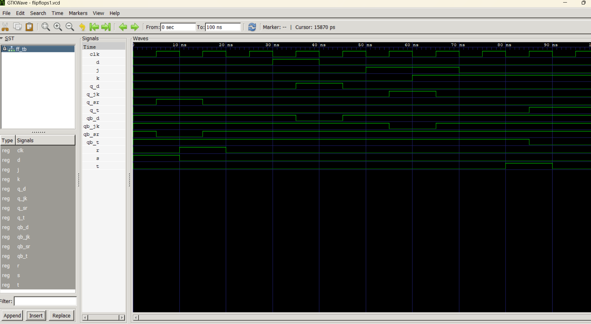
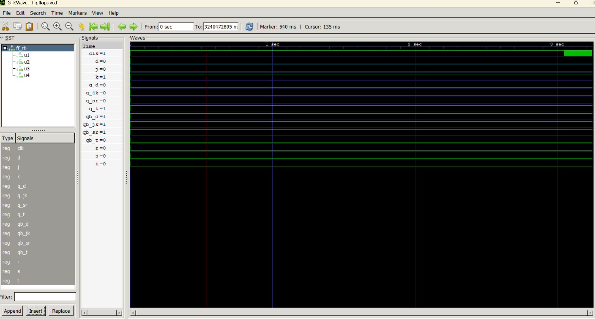

# Lab 7: VHDL Code for Sequential Circuits (Flip-Flops)

## Objective
- To design and simulate SR, D, JK, and T Flip-Flops using VHDL.
- To understand the role of the clock signal in sequential circuits.
- To verify the operation of different flip-flops using GHDL and GTKWave.

---

## Theory

### SR Flip-Flop

An **SR (Set-Reset) Flip-Flop** is a basic sequential circuit that stores one bit of information. Its output changes according to the inputs **S (Set)** and **R (Reset)** on the rising edge of the clock.

| S | R | Q (Next) |
|---|---|----------|
| 0 | 0 | Hold     |
| 0 | 1 | Reset (0)|
| 1 | 0 | Set (1)  |
| 1 | 1 | Forbidden|

---

### D Flip-Flop

A **D (Data) Flip-Flop** stores the value present at the input **D** on the rising edge of the clock. It eliminates the invalid state of the SR Flip-Flop by using a single data input.

**Characteristic Equation:**

```
Q(next) = D
```

---

### JK Flip-Flop

A **JK Flip-Flop** is an improved version of the SR Flip-Flop. It removes the forbidden state by allowing the output to toggle when both inputs are HIGH.

| J | K | Q (Next) |
|---|---|----------|
| 0 | 0 | Hold     |
| 0 | 1 | Reset    |
| 1 | 0 | Set      |
| 1 | 1 | Toggle   |

---

### T Flip-Flop

A **T (Toggle) Flip-Flop** changes its output state whenever the input **T** is HIGH during the rising edge of the clock. If **T = 0**, the output remains unchanged.

**Characteristic Equation:**

```
Q(next) = T ⊕ Q
```

---

## Output





## Conclusion

In this lab, we successfully designed and simulated four fundamental sequential circuits using VHDL: the **SR**, **D**, **JK**, and **T Flip-Flops**. The simulation results verified that each flip-flop behaved according to its characteristic operation on the rising edge of the clock. The SR Flip-Flop demonstrated set, reset, and hold operations; the D Flip-Flop stored the input data; the JK Flip-Flop performed set, reset, hold, and toggle operations without any forbidden state; and the T Flip-Flop toggled its output whenever the toggle input was HIGH.

This experiment provided a clear understanding of how sequential circuits differ from combinational circuits by storing previous states and relying on clock signals for state transitions. It also reinforced the concepts of memory elements, synchronization, and hardware modeling using VHDL, which are essential in the design of digital systems and computer architecture.