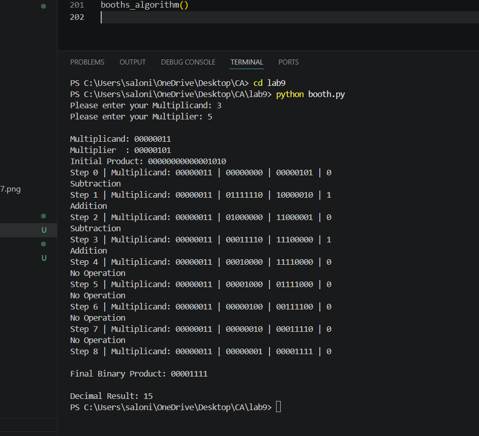

Lab Report
Lab 9: Implementation of Booth's Multiplication Algorithm Using Python
Title

Implementation of Booth's Multiplication Algorithm Using Python

Objective
To understand Booth's Multiplication Algorithm.
To implement Booth's Algorithm using Python.
To perform multiplication of signed binary numbers.
To observe each step of the multiplication process.
Theory

Booth's Algorithm is an efficient multiplication algorithm used for multiplying signed binary numbers represented in two's complement form. It minimizes the number of addition and subtraction operations by examining two adjacent bits of the multiplier at a time.

The algorithm works by maintaining:

A (Accumulator)
Q (Multiplier)
Q-1 (Extra Bit)

At every iteration:

If Q₀Q₋₁ = 00 or 11, no arithmetic operation is performed.
If Q₀Q₋₁ = 01, the multiplicand is added to the accumulator.
If Q₀Q₋₁ = 10, the multiplicand is subtracted from the accumulator.

After the operation, an arithmetic right shift is performed. The process continues for the number of bits in the multiplier.

Advantages
Efficient for signed number multiplication.
Reduces the number of arithmetic operations.
Widely used in computer processors.
Algorithm
Read the multiplicand and multiplier.
Convert both numbers into 8-bit binary.
Initialize the product register.
Repeat for 8 iterations:
Check the last two bits.
Perform addition, subtraction, or no operation.
Perform arithmetic right shift.
Display the final binary product.
Convert the result into decimal.
Program

Python Code

(Paste your complete Python program here.)

Input
Multiplicand = 3
Multiplier = 5
Output
Terminal Output

Paste Screenshot Here

(Insert the attached terminal screenshot.)

Observation
Step	Operation
Initial	Product Register Initialized
Step 1	Subtraction
Step 2	Addition
Step 3	Subtraction
Step 4	Addition
Step 5	No Operation
Step 6	No Operation
Step 7	No Operation
Step 8	No Operation

Final Binary Product:

00001111

Decimal Result:

15
Result

The Booth's Multiplication Algorithm was successfully implemented in Python. For the given inputs:

Multiplicand = 3
Multiplier = 5

the algorithm correctly produced:

Binary Product = 00001111
Decimal Product = 15

Thus, the multiplication result matches the expected output.

Conclusion

The experiment successfully demonstrated the implementation of Booth's Multiplication Algorithm using Python. The algorithm correctly handled the multiplication process by performing addition, subtraction, and arithmetic right shifts according to Booth's rules. It efficiently produced the correct binary and decimal multiplication results. This experiment helped in understanding how signed binary multiplication is performed efficiently in computer architecture.

Screenshot

